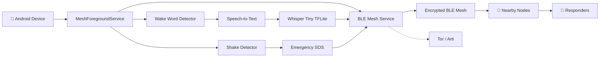

# 📡 Meshwave – Decentralized Emergency Mesh Network

A privacy-focused, off-grid emergency communication system that enables peer-to-peer messaging when internet and cellular networks are unavailable.

Meshwave uses **Bluetooth Low Energy (BLE), offline AI, end-to-end encryption, and decentralized mesh networking** to provide resilient communication during emergencies.

## 📌 Project Overview

Meshwave allows nearby devices to communicate directly without relying on centralized servers or cellular infrastructure.

The system provides two emergency communication mechanisms:

* 🎙️ **Ok Mesh** – Hands-free voice-to-text emergency messaging
* 📳 **Shake2Rescue** – Gesture-based SOS broadcasting

## 🏗️ System Architecture



## ⚙️ Technologies Used

### 📱 Android

* Kotlin
* Android SDK
* Android Studio
* Foreground Services

### 🤖 AI / Speech

* Whisper Tiny
* TensorFlow Lite
* Offline Speech-to-Text
* Wake Word Detection

### 📡 Networking

* Bluetooth Low Energy (BLE)
* Peer-to-Peer Mesh Networking
* Tor / Arti

### 🔐 Security

* Noise Protocol Framework
* End-to-End Encryption

## 🚨 Key Features

### 🎙️ Ok Mesh – Hands-Free Messaging

1. User says **"Ok Mesh"**.
2. The wake-word detector activates.
3. The app records speech for **10 seconds**.
4. Whisper Tiny converts speech to text locally.
5. The encrypted message is broadcast through the BLE mesh.

### 📳 Shake2Rescue – Emergency SOS

1. The device detects vigorous shaking.
2. Shake detection triggers an emergency handshake.
3. A high-priority SOS packet is generated.
4. The packet is broadcast to nearby mesh nodes.
5. Mesh nodes relay the emergency message to available responders.

## 🔄 System Workflow

```text
User
 │
 ├── "Ok Mesh"
 │      ↓
 │  Voice Capture
 │      ↓
 │  Whisper Tiny
 │      ↓
 │  Text Message
 │
 └── Shake Device
        ↓
    Emergency SOS
        │
        ▼
   Encryption
        │
        ▼
   BLE Mesh Network
        │
        ▼
 Nearby Mesh Nodes
        │
        ▼
   Responders
```

## 🔐 Security & Privacy

* 🔒 End-to-end encryption using the **Noise Protocol Framework**
* 🤖 Voice processing performed locally on the device
* 🌐 Optional anonymity using **Tor / Arti**
* 🏢 No centralized communication server
* 🔐 Only encrypted text is shared across the mesh

## 📁 Project Structure

```text
meshwave-android/
│
├── app/
│   └── src/main/
│       ├── assets/
│       │   └── models/
│       │       └── whisper-tiny.tflite
│       │
│       ├── java/
│       ├── res/
│       └── AndroidManifest.xml
│
├── docs/
├── README.md
└── LICENSE
```

## 🛠️ Setup

### Clone the Repository

```bash
git clone https://github.com/your-repo/meshwave-android.git
cd meshwave-android
```

Open the project in **Android Studio** and add the Whisper Tiny model to:

```text
app/src/main/assets/models/whisper-tiny.tflite
```

Build and install the application on a **physical Android device** for accurate BLE, microphone, and sensor testing.

## 🎯 Use Cases

* 🌪️ Natural disasters
* 📡 Network outages
* 🏔️ Remote-area emergencies
* 🚨 Disaster response
* 🧭 Outdoor emergency situations

## 🚀 Future Enhancements

* Offline emergency maps
* Improved multi-hop routing
* Better battery optimization
* Emergency responder mode
* Enhanced location sharing
* Improved offline speech recognition

## 📄 License

This project is licensed under the **MIT License**.

See the [`LICENSE`](LICENSE) file for details.

## ⚠️ Disclaimer

Meshwave is intended for **educational, research, and experimental purposes**. It should not be considered a replacement for established emergency communication services. Always maintain a backup communication method for critical situations.
